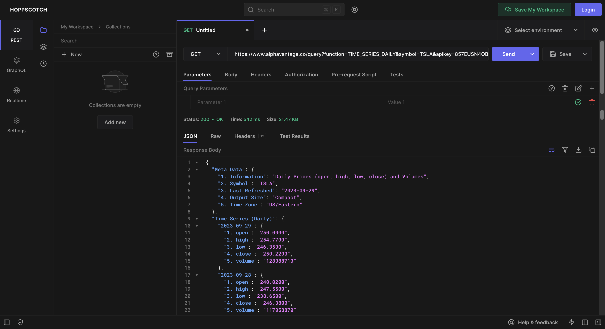

# trading-API
Problem Domain: Finance

Description: We are making an engaging and educational stock trading game that allows players to test their knowledge 
and skills in the world of finance and investing. There will be two or more prompts on which financial investment 
should a player choose. Players will then choose and by the end of the game, players can compare their earnings and
losses. 

Link to API document: https://www.alphavantage.co/documentation/

Screenshot: 

Example output of running Java code: 

A list of any technical problems blocking progress: 
